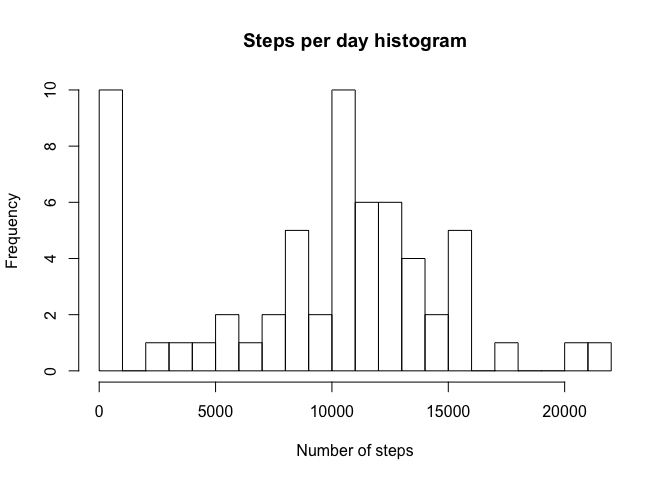
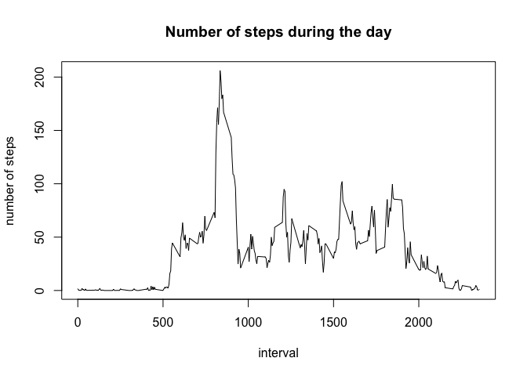
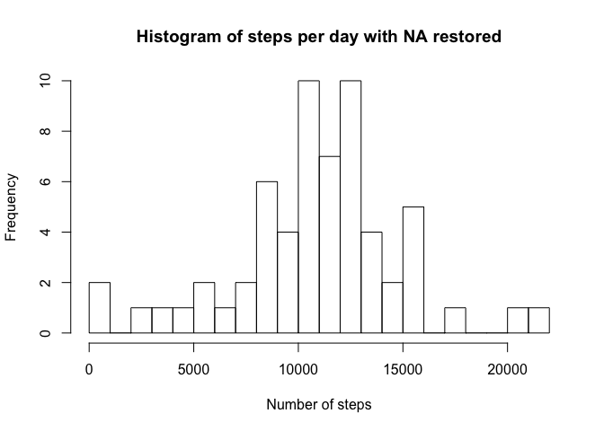
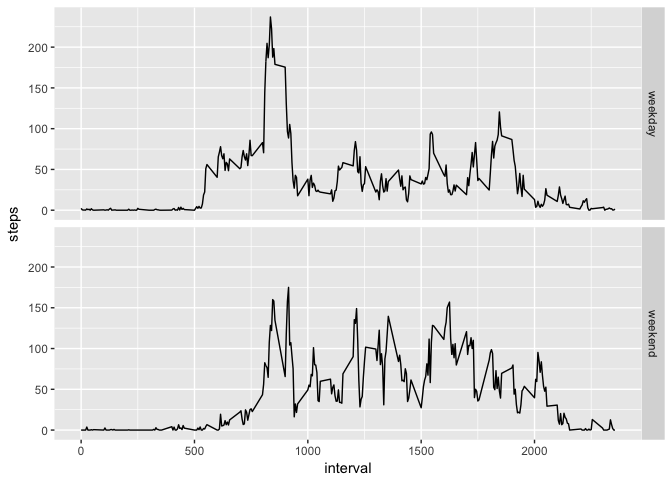

## Loading and preprocessing the data


```r
data_file <- unzip("activity.zip")
activity_data <- read.csv(data_file)

library(dplyr)
```

```
## 
## Attaching package: 'dplyr'
```

```
## The following objects are masked from 'package:stats':
## 
##     filter, lag
```

```
## The following objects are masked from 'package:base':
## 
##     intersect, setdiff, setequal, union
```

```r
library(lubridate)
```

```
## 
## Attaching package: 'lubridate'
```

```
## The following object is masked from 'package:base':
## 
##     date
```

```r
activity_data$wd <- weekdays(as.Date(activity_data$date))
steps_per_day <- activity_data %>% group_by(date) %>%  
        summarise(steps  = sum(steps, na.rm = T))
steps_per_interval <- activity_data %>% group_by(interval) %>%  
        summarise(steps  = mean(steps, na.rm = T))
```


## What is mean total number of steps taken per day?
Histogram of the total number of steps taken each day:


```r
hist(steps_per_day$steps, 20, main="Steps per day histogram", 
     xlab = "Number of steps")
```

<!-- -->

Mean and median total number of steps taken per day

```r
median(steps_per_day$steps)
```

```
## [1] 10395
```

```r
mean(steps_per_day$steps)
```

```
## [1] 9354.23
```


## What is the average daily activity pattern?

There is a plot of the 5-minute interval (x-axis) 
and the average number of steps taken, averaged across all days (y-axis)

```r
plot(steps_per_interval$interval, steps_per_interval$steps, type="l", 
     main="Number of steps during the day", xlab = "interval", ylab = "number of steps")
```

<!-- -->

Find 5-minute interval, on average across all the days in the dataset, contains the maximum number of steps

```r
interval_max <- max(steps_per_interval$steps)
steps_per_interval[steps_per_interval$steps == interval_max,]
```

```
## # A tibble: 1 x 2
##   interval steps
##      <int> <dbl>
## 1      835  206.
```

## Imputing missing values
Total number of missing values in the dataset (i.e. the total number of rows with `NA`s)

```r
nrow(subset(activity_data, is.na(activity_data$steps)))
```

```
## [1] 2304
```

```r
nrow(subset(activity_data, is.na(activity_data$date)))
```

```
## [1] 0
```

```r
nrow(subset(activity_data, is.na(activity_data$interval)))
```

```
## [1] 0
```
As you can see, we have missing values just in the **steps** column.
Filling in all of the missing values in the dataset with an averege on the given interval and a week day. 

```r
means <- activity_data %>% group_by(interval, wd) %>%  
        summarise(val  = round(mean(steps, na.rm = T), digits = 0))

findMean <- function(x, y){
        res <- subset(means, interval == x & wd == y)
        ifelse(length(res) == 0, 0, res[1, 3])
}

activity_data1 <- activity_data
for(i in 1:nrow(activity_data1)){
        activity_data1[i,1] <- ifelse(is.na(activity_data1[i, 1]), 
        findMean(activity_data1[i, 3], activity_data1[i, 4]), 
        activity_data1[i, 1])
        }
```


Histogram of the total number of steps taken each day with restored NA values


```r
steps_per_day1 <- activity_data1 %>% group_by(date) %>%  
        summarise(steps  = sum(steps, na.rm = T))
hist(steps_per_day1$steps, 20, main = "Histogram of steps per day with NA restored",
     xlab = "Number of steps")
```

<!-- -->

```r
median(steps_per_day1$steps)
```

```
## [1] 11015
```

```r
mean(steps_per_day1$steps)
```

```
## [1] 10821.1
```


## Are there differences in activity patterns between weekdays and weekends?

```r
library(ggplot2)
activity_data1$wflag <- ifelse(activity_data1$wd %in% c("Saturday", "Sunday"), 
                               "weekend", "weekday")
steps_per_interval1 <- activity_data1 %>% group_by(interval, wflag) %>%  
        summarise(steps  = mean(steps, na.rm = T))
p <- ggplot(steps_per_interval1, aes(interval, steps)) + geom_line() 
p + facet_grid(wflag ~ .)
```

<!-- -->
